<p align="center">
  <picture>
    <source media="(prefers-color-scheme: dark)" srcset="docs/umai-logo.png">
    
  </picture>
</p>

<p align="center">
  
</p>

# UMAI Core (Community Edition)

**The Open-Source Kernel Semantic Firewall (KSF) for the AI Ecosystem**

UMAI Core is not a traditional firewall. It is a lightweight, open-source network validation and enforcement agent that runs directly inside the Linux kernel space using eBPF (Extended Berkeley Packet Filter) and XDP (eXpress Data Path).

By hooking straight into the earliest possible stage of the network driver's packet entry gate, UMAI Core evaluates and enforces AI application protocols at raw line speed. It inspects conversational structures, tools, and machine identities the exact microsecond they arrive, dropping unauthorized or malicious requests before the main operating system spends memory or CPU cycles processing the packet.

## 🔌 AI-Exclusive Protocol Target Matrix

Unlike legacy network appliances or software WAFs, UMAI Core features deep-packet parsing engines optimized specifically to inspect and enforce the structured signatures of the autonomous AI ecosystem:

**Vendor Interoperability Rails:** MCP (Anthropic), A2A (Google), FCP (OpenAI), and ACP (IBM).

**Framework & Orchestration Schemas:** TAP (LangChain), AGP (Industry Standards), and OAP (Community Core).

**Planning & Knowledge Graph Frameworks:** TDF (Stanford), RDF-Agent (W3C), and AgentOS runtimes.

## 🛠️ Core Capabilities

**Kernel-Resident Tracking:** Zero dependency on slow, high-latency user-space application proxies, sidecars, container wrappers, or software gateways.

**Line-Speed Interception:** Operates at the network interface card (NIC) driver level via XDP, resolving security constraints in microseconds rather than milliseconds.

**Rust Terminal User Interface (TUI):** A blazing-fast, keyboard-driven command-line dashboard mapping real-time allowed/dropped packets and protocol distribution graphs with near-zero computing overhead.

**Local Hardening (`umai.toml`):** Complete file-based rules configuration. Save your parameters, and the local Rust daemon immediately updates active in-kernel memory maps (`BPF_MAP_TYPE_HASH`).

## 🚀 Quick Start

### 1. Installation

Clone the repository and compile the user-space loader daemon:

```bash
git clone https://github.com/UMAI-Community/umai-core-ce.git
cd umai-core-ce
cargo build --release -p umai-loader --no-default-features --features ce
```

### 2. Build or Fetch the Kernel Bytecode

The `umai-loader` expects a pre-compiled eBPF object file. You can compile the kernel-space bytecode using our pinned Docker configuration:

```bash
# Build the specialized eBPF object builder
docker build -f Dockerfile.ebpf -t umai-core-ebpf:0.1 .

# Extract the compiled ELF asset into your directory
docker run --rm -v $PWD/dist:/out umai-core-ebpf:0.1
```

### 3. Run UMAI Core

Load the compiled eBPF program directly into the network interface driver's receive path. (If testing inside a development VM or virtual network namespace where native driver XDP isn't supported, pass the `--xdpgeneric` flag to fall back gracefully):

```bash
sudo ./target/release/umai-loader --iface eth0 --kernel-object dist/umai-kernel --xdpgeneric
```

## About Us

Our mission is to build the technology that helps the world understand, navigate, and secure the AI ecosystem.

The internet is evolving past a static collection of pages into a high-computational landscape of self-healing networks, predictive personalization, and an autonomous agent economy. UMAI Intelligence provides the technical clarity this infrastructure demands. We surface the entire public AI ecosystem—from model servers and capability protocols to agentic payment endpoints—providing the ground truth for an environment expanding faster than it can be secured.

UMAI Core is our open-source contribution to this mission. We build the bare-metal software plumbing, secure data pipelines, and hardware isolation platforms required to protect, validate, and stabilize AI systems. Our goal is to transform network visibility, turning probabilistic AI conversational states into hard, deterministic infrastructure defense.

## Local Configuration & Automation

UMAI Core's intel map (`umai_intel_map`) is fully writable from userspace, so you can feed it with rules from a static config file, a log-parser cron job, your existing IDS hook, or whatever upstream system already knows what to block. The `examples/` directory ships two starting points.

### `examples/umai-core.toml`

Sample configuration showing the intended schema for v0.2's TOML config loader — interface defaults, ANS-protection blocklists with operator audit notes, and (for paid tiers) cloud-sync wiring. v0.1.0's loader doesn't yet parse this file directly, but it serves today as a documented source of truth that scripts and operators can read against.

### `examples/umai-sync.sh`

A small bash wrapper around `bpftool map update / delete` that lets any upstream tool inject or remove IPv4 signatures at runtime — no loader recompile, no daemon restart:

```bash
sudo ./examples/umai-sync.sh 198.51.100.42 block     # add to intel map
sudo ./examples/umai-sync.sh 198.51.100.42 unblock   # remove from intel map
sudo ./examples/umai-sync.sh list                    # dump current entries
sudo ./examples/umai-sync.sh stats                   # per-CPU drop / pass counters
```

Wire this into:

- `fail2ban` action scripts — escalate from `iptables` → kernel-level `XDP_DROP`
- Suricata / Snort `eve.json` parsers — auto-block IPs above a noise threshold
- Honeypot tooling — promote attacking IPs into the live map automatically
- CI / GitOps — deploy blocklist changes as code alongside the rest of your infrastructure

## 📄 License

UMAI Core (Community Edition) is dual-licensed:

- **Userspace crates** (`umai-loader`, `umai-tui`, `umai-common`) — Apache License 2.0. See [LICENSE](LICENSE).
- **Kernel crate** (`umai-kernel`) — GNU General Public License v2.0 (required by the Linux eBPF verifier). See [umai-kernel/LICENSE](umai-kernel/LICENSE).

See [NOTICE](NOTICE) for the rationale behind the split and trademark guidance.
