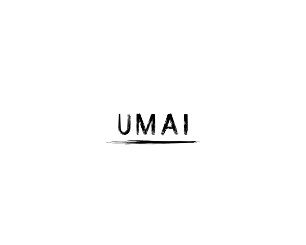

<p align="center">
  
</p>

# UMAI Core (Community Edition)

**The Open-Source Kernel Semantic Firewall (KSF) for the AI Ecosystem**

UMAI Core is not a traditional firewall. It is a lightweight, open-source network monitoring and enforcement agent that runs directly inside the Linux kernel space using eBPF (Extended Berkeley Packet Filter) and XDP (eXpress Data Path).

By hooking straight into the earliest possible stage of the network driver's packet entry gate, UMAI Core evaluates and enforces AI application protocols at raw line speed. It inspects conversational structures, tools, and machine identities the exact microsecond they arrive, dropping unauthorized or malicious requests before the main operating system spends memory or CPU cycles processing the packet.

## 🔌 AI-Exclusive Protocol Target Matrix

Unlike legacy network appliances or software WAFs, UMAI Core features deep-packet parsing engines optimized specifically to inspect and enforce the structured signatures of the autonomous AI ecosystem:

**Vendor Interoperability Rails:** MCP (Anthropic), A2A (Google), FCP (OpenAI), and ACP (IBM).

**Framework & Orchestration Schemas:** TAP (LangChain), AGP (Industry Standards), and OAP (Community Core).

**Planning & Knowledge Graph Frameworks:** TDF (Stanford), RDF-Agent (W3C), and AgentOS runtimes.

## 🛠️ Core Capabilities

**Kernel-Resident Tracking:** Zero dependency on slow, high-latency user-space application proxies, sidecars, container wrappers, or software gateways.

**Line-Speed Interception:** Operates at the network interface card (NIC) driver level via XDP, resolving security constraints in microseconds rather than milliseconds.

**Rust Terminal User Interface (TUI):** A blazing-fast, keyboard-driven command-line dashboard mapping real-time allowed/dropped packets and protocol distribution graphs with near-zero computing overhead.

**Local Hardening (`umai.toml`):** Complete file-based rules configuration. Save your parameters, and the local Rust daemon immediately updates active in-kernel memory maps (`BPF_MAP_TYPE_HASH`).

## 🚀 Quick Start

### 1. Installation

Clone the repository and compile the user-space Rust agent and kernel-space eBPF bytecode:

```bash
git clone https://github.com/UMAI-Community/umai-core-ce.git
cd umai-core-ce
cargo build --release
```

### 2. Configure Local Rules & Network Mapping

Define your interfaces, internal network boundaries, and protocol execution constraints in your local configuration file:

```toml
# umai.toml
[interface]
name = "eth0"
mode = "native"

[network]
internal_cidr = "10.0.0.0/8"
internal_domains = ["*.entelijan.local"]

[protocols.mcp]
enforce_strict_jsonrpc = true
allowed_tools = ["read_db", "fetch_status"]
```

### 3. Run UMAI Core

Load the eBPF program into the kernel receive queue and launch the local terminal dashboard:

```bash
sudo ./target/release/umai-monitor-agent --config umai.toml
```

## About Us

Entelijan is an engineering-first, core artificial intelligence intelligence architecture firm specializing in technical telemetry, AI-specific network protocols, and the intersection of machine autonomy with cybersecurity.

We don't look at web application layers through legacy lenses. We build the bare-metal software plumbing, secure data pipelines, and hardware isolation platforms required to protect, validate, and stabilize the machine-to-machine economy. Our mission is to transform network visibility, turning probabilistic AI conversational states into hard, deterministic infrastructure defense.

## 📄 License

UMAI Core (Community Edition) is dual-licensed:

- **Userspace crates** (`umai-loader`, `umai-tui`, `umai-common`) — Apache License 2.0. See [LICENSE](LICENSE).
- **Kernel crate** (`umai-kernel`) — GNU General Public License v2.0 (required by the Linux eBPF verifier). See [umai-kernel/LICENSE](umai-kernel/LICENSE).

See [NOTICE](NOTICE) for the rationale behind the split and trademark guidance.
